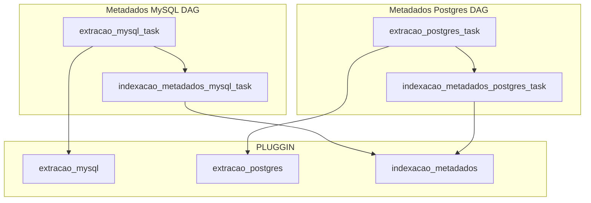

# Teste Técnico

## O que fazer neste desafio tecnico?

- [OK] Ambiente em docker
- [OK] Dag para extrair os metadados do mysql e salvar no amundsen
- [OK] Dag para extrair os metadados do postgres e salvar no amundsen
- [NOK] (opcional) Subir um banco NoSQL e efetuar a extração dos metadados

## Arquitetura da solução

