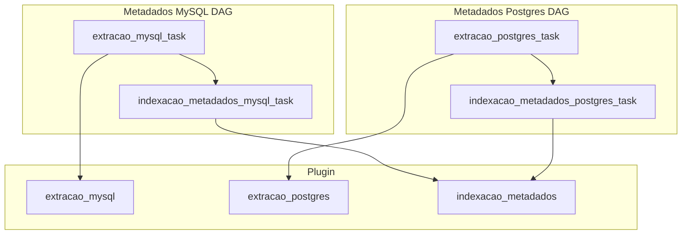

# Teste Técnico (Airflow/Amundsen)

## O que fazer neste desafio técnico?

- [OK] Ambiente em docker
- [OK] Dag para extrair os metadados do MySQL e salvar no Amundsen
- [OK] Dag para extrair os metadados do Postgres e salvar no Amundsen
- [NOK] (opcional) Subir um banco NoSQL e efetuar a extração dos metadados

## Arquitetura da solução

